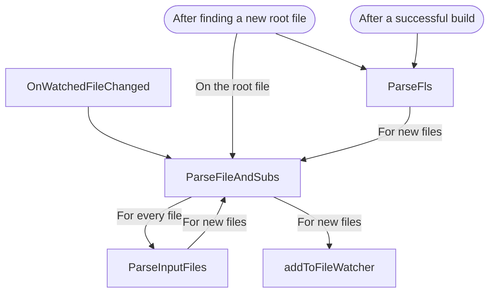

# Development documentation

## The manager logic

The manager is responsible for detecting the correct root file and once detected to parse the whole project. Its logic is shown as follows.

```mermaid
graph TD
  A[OnWatchedFileChanged] --> B[ParseFileAndSubs];
  C([After finding a new root file]) -->|On the root file| B;
  C --> D[ParseFls];
  E([After a successful build]) --> D;
  D -->|For new files| B;
  B -->|For every file| F[ParseInputFiles];
  B -->|For new files| G[addToFileWatcher];
  F -->|For new files| B
```
