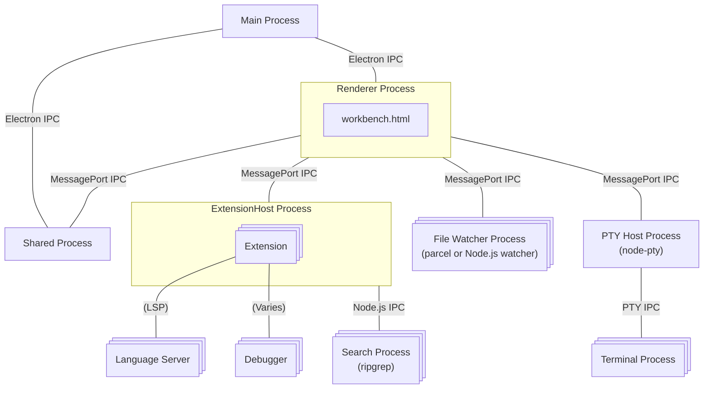

## Architecture of VS Code

## Creating processes

The main process creates the renderer process, search process, extension host, file watcher process, and PTY host process. MessagePorts are created and transferred to each process as needed. The steps involved in spawning a new process can vary in several ways; in some instances, other processes may request the main process to create them.

### Where actually spawned

- renderer 
  - https://github.com/microsoft/vscode/blob/1f48d5756c8b17f17a9a3e2dda2aa0ad4e6b7ce3/src/vs/platform/windows/electron-main/windowImpl.ts#L640
  - https://github.com/Microsoft/vscode/blob/1f48d5756c8b17f17a9a3e2dda2aa0ad4e6b7ce3/src/vs/platform/windows/electron-main/windowImpl.ts#L1105
- extension host
  - https://github.com/Microsoft/vscode/blob/708b6aa379c2c9d12c65123c8934ca5a6a29046d/src/vs/platform/utilityProcess/electron-main/utilityProcess.ts#L249
  - https://github.com/Microsoft/vscode/blob/708b6aa379c2c9d12c65123c8934ca5a6a29046d/src/vs/platform/extensions/electron-main/extensionHostStarter.ts#L107-L108
- shared process 
  - https://github.com/Microsoft/vscode/blob/708b6aa379c2c9d12c65123c8934ca5a6a29046d/src/vs/platform/sharedProcess/electron-main/sharedProcess.ts#L173
- watcher
  - https://github.com/Microsoft/vscode/blob/708b6aa379c2c9d12c65123c8934ca5a6a29046d/src/vs/workbench/services/files/electron-sandbox/watcherClient.ts#L36
- search
  - https://github.com/Microsoft/vscode/blob/ff48b17c8bac582dfa4deb088dd0bb88c3049d54/src/vs/workbench/services/search/node/ripgrepTextSearchEngine.ts#L75
- pty
  - https://github.com/Microsoft/vscode/blob/708b6aa379c2c9d12c65123c8934ca5a6a29046d/src/vs/platform/terminal/electron-main/electronPtyHostStarter.ts#L58
- debugger
  - https://github.com/Microsoft/vscode/blob/31092ac1a0f9e68026cd0796f184fd3dfe978069/src/vs/workbench/contrib/debug/node/debugAdapter.ts#L221

### How MessagePorts transfered
- https://github.com/Microsoft/vscode/blob/708b6aa379c2c9d12c65123c8934ca5a6a29046d/src/vs/platform/utilityProcess/electron-main/utilityProcess.ts#L427 
  - 'vscode:startExtensionHostMessagePortResult' のような文字列(responseChannel)と通信用の port を渡す

## Source Code Organization

- workbench/, electron-sandbox/ = renderer process

workbench で node のときはだいたい extension host で実行される. その場合 extension host のその機能は
workbench (renderer) から呼び出せるようになっている.

## Links

- https://github.com/microsoft/vscode/wiki/Source-Code-Organization
- https://code.visualstudio.com/blogs/2022/11/28/vscode-sandbox
- https://code.visualstudio.com/blogs/2022/11/28/vscode-sandbox#_moving-processes-out-of-the-renderer
