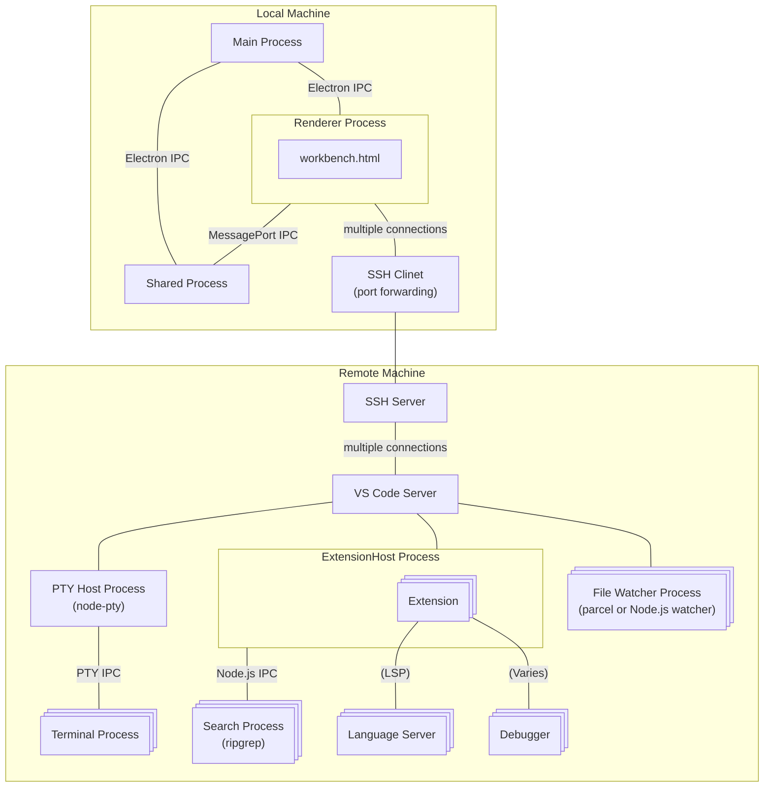

## Architecture of VS Code Remote

## Links

- https://github.com/jeanp413/open-remote-ssh/tree/master

The role of the VS Code Remote extension is to establish a connection with the remote machine using SSH, download the VS Code Server on the remote, start the server, and establish port forwarding from the local machine. 

A connection from the renderer process to each process on the remote machine is established via SSH port forwarding and VS Code Server.
