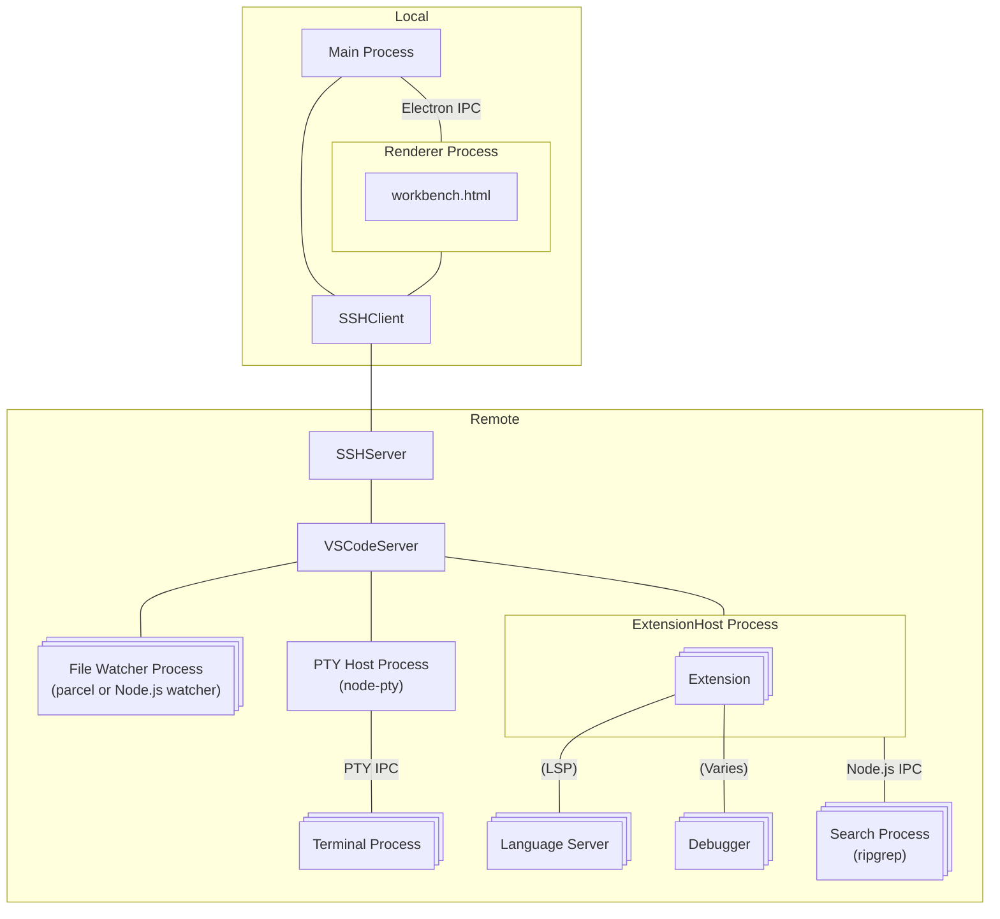

## Architecture of VS Code Remote

```mermaid
flowchart TB
    subgraph Local
        MainProcess[Main Process]
        subgraph RendererProcess [Renderer Process]
            workbench.html
        end
        SSHClient
    end
    subgraph Remote
        SSHServer
        VSCodeServer
        subgraph ExtensionHostProcess  [ExtensionHost Process]
            Extension@{ shape: procs }
        end
        SearchProcess@{ shape: procs, label: "Search Process<br/>(ripgrep)" }
        PTYHostProcess@{ label: "PTY Host Process<br/>(node-pty)" }
        TerminalProcess@{ shape: procs, label: "Terminal Process" }
        FileWatcherProcess@{ shape: procs, label: "File Watcher Process<br/>(parcel or Node.js watcher)" }
        LanguageServer@{ shape: procs, label: "Language Server" }
        Debugger@{ shape: procs }
    end
    MainProcess -- Electron IPC --- RendererProcess
    MainProcess --- SSHClient
    RendererProcess --- SSHClient
    SSHClient --- SSHServer
    SSHServer --- VSCodeServer
    VSCodeServer --- ExtensionHostProcess
    VSCodeServer --- FileWatcherProcess
    VSCodeServer --- PTYHostProcess
    PTYHostProcess -- PTY IPC --- TerminalProcess
    ExtensionHostProcess -- Node.js IPC --- SearchProcess
    Extension -- (LSP) --- LanguageServer
    Extension -- (Varies) --- Debugger
```
