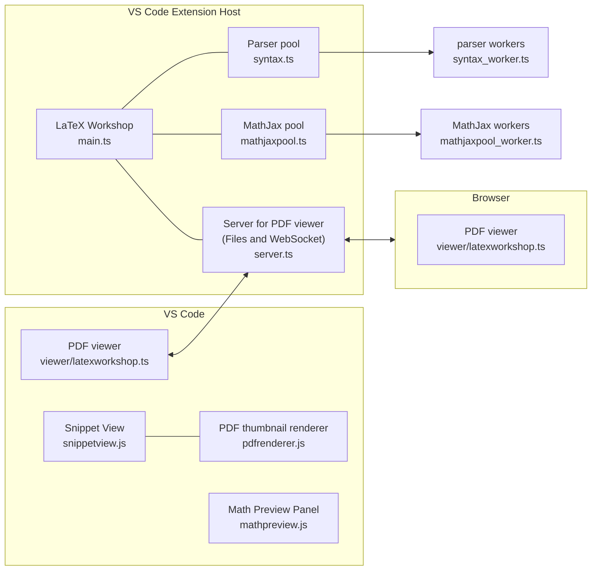
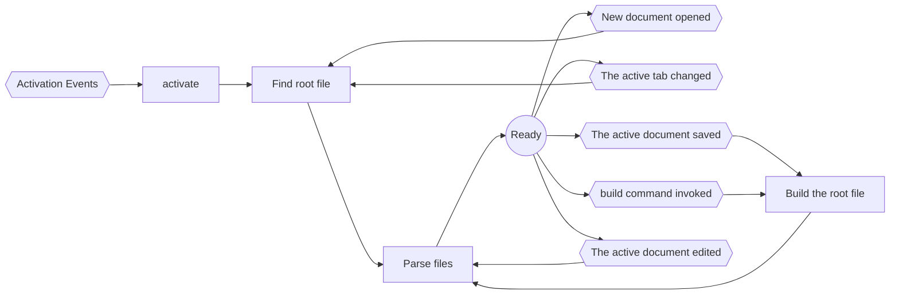

# Overview

[Providers](https://code.visualstudio.com/api/language-extensions/programmatic-language-features#language-features-listing) are defined under `providers/` and are registered in `main.ts`. All other components of the extension are defined under `components/`. These components are properties of the `Extension` class, which is defined in `main.ts` and can be accessed when needed. The `Extension` class is a type of [service locator](https://martinfowler.com/articles/injection.html#UsingAServiceLocator), which is a design pattern that helps manage dependencies in an application.

## Root file

LaTeX Workshop is different from other VS Code extensions in how it treats the root file. Typically, programming language extensions have only one compilation target per workspace. However, LaTeX Workshop dynamically detects the root file and target based on the currently edited document. For more details, see the [wiki](https://github.com/James-Yu/LaTeX-Workshop/wiki/Compile#the-root-file). The `Manager.findRoot()` function handles this process, which works well with multi-root workspaces.

## AST cache

The AST (Abstract Syntax Tree) for LaTeX files is managed by `components/astmanager.ts`. The `AstManager` also handles the parse call.
As long as you access the AST through `AstManager`, the same file won't be parsed multiple times unnecessarily.

## Application Log

When something goes wrong, we always add to log messages what went wrong with `Extension.logger`. It is much beneficial for debugging.

## VS Code filesystem and virtual workspaces

See [#2669](https://github.com/James-Yu/LaTeX-Workshop/pull/2669).

## EventBus

See [#3193](https://github.com/James-Yu/LaTeX-Workshop/pull/3193).

## workerpool

To avoid blocking the main loop of the extension host process, we execute some heavy tasks in child processes using [workerpool](https://github.com/josdejong/workerpool). `workerpool` is a library that allows us to create a pool of worker threads that can execute tasks in parallel. By using `workerpool`, we can offload CPU-intensive tasks to separate processes and keep the main thread responsive.

See:

- https://github.com/tamuratak/LaTeX-Workshop/blob/main/src/components/utensilsparser.ts
- https://github.com/tamuratak/LaTeX-Workshop/blob/main/src/components/mathpreviewlib/mathjaxpool.ts

## Architecture

## flowchart

