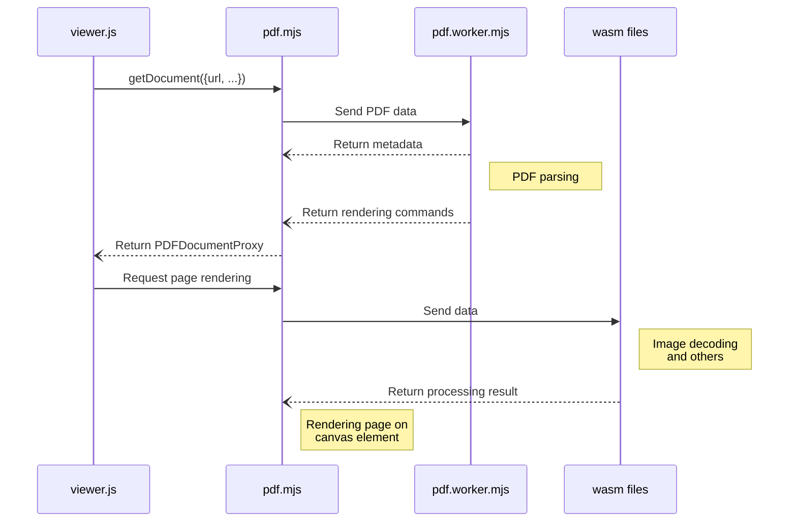

# Architecture of PDF.js viewer

```mermaid
sequenceDiagram
    participant ViewerJS as viewer.js
    participant PDFJS as pdf.mjs
    participant WorkerJS as pdf.worker.mjs
    participant Wasm as wasm files

    ViewerJS->>PDFJS: getDocument({url, ...})
    PDFJS->>WorkerJS: Send PDF data
    WorkerJS--)PDFJS: Return metadata

    Note right of WorkerJS: PDF parsing

    WorkerJS--)PDFJS: Return rendering commands
    PDFJS--)ViewerJS: Return PDFDocumentProxy
    ViewerJS->>PDFJS: Request page rendering
    PDFJS->>Wasm: Send data
    Note right of Wasm: Image decoding<br> and others
    Wasm--)PDFJS: Return processing result

    Note right of PDFJS: Rendering page on <br> canvas element
```
