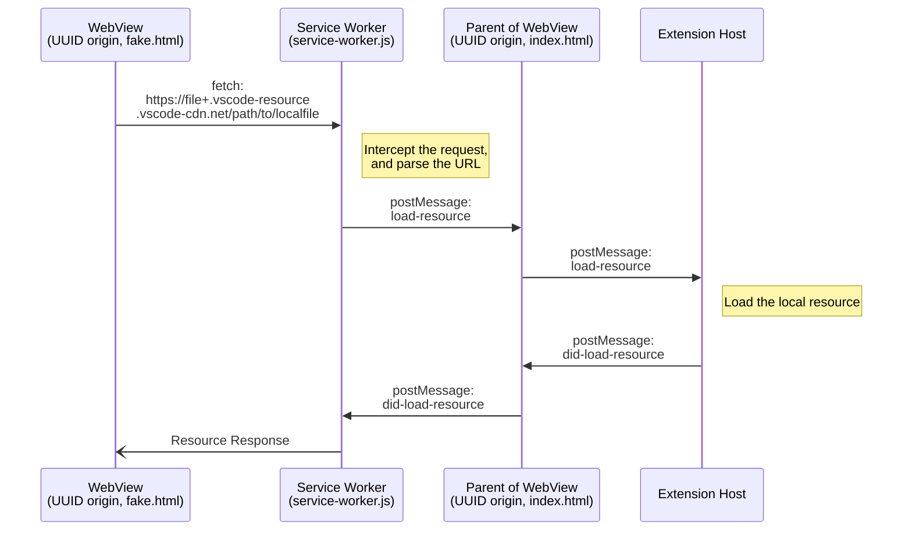

# Architecture of VS Code WebView

```mermaid
sequenceDiagram
    participant WebView as WebView <br>(UUID origin, fake.html)
    participant ServiceWorker as Service Worker <br> (service-worker.js)
    participant ParentClient as Parent of WebView <br>(UUID origin, index.html)
    participant ExtensionHost as Extension Host 

    WebView->>ServiceWorker: fetch: <br>https://file+.vscode-resource<br>.vscode-cdn.net/path/to/localfile
    Note right of ServiceWorker: Intercept the request,<br> and parse the URL
    ServiceWorker->>ParentClient: postMessage:<br>load-resource
    ParentClient->>ExtensionHost: postMessage:<br>load-resource
    Note right of ExtensionHost: Load the local resource
    ExtensionHost->>ParentClient: postMessage:<br>did-load-resource
    ParentClient->>ServiceWorker: postMessage:<br>did-load-resource
    ServiceWorker-)WebView: Resource Response
```
